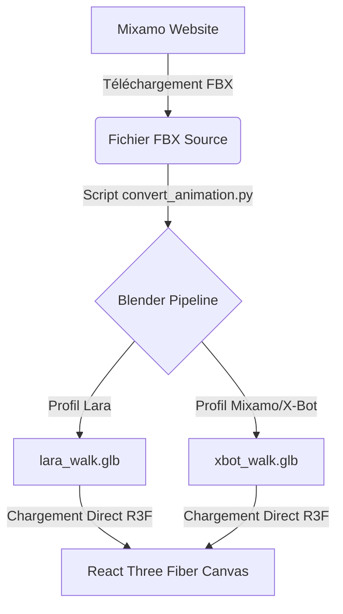

# Pipeline de Conversion d'Animations dans Blender (FBX vers GLB)

> [!IMPORTANT]
> **Modèle de Référence de l'Application :**
> Le modèle de référence utilisé et parfaitement fonctionnel dans le projet room3d est `public/media/sandbox/Xbot_official.glb` (issu des exemples officiels de Three.js).
> **Ne pas le confondre avec le modèle X-Bot FBX brut de Mixamo.** Le squelette cible pour l'application doit correspondre à celui de `Xbot_official.glb` qui sert de calibrateur et d'échelle de référence.

Ce document décrit la méthode la plus propre et performante pour traiter et convertir des fichiers d'animation sources FBX (Mixamo) en fichiers GLB prêts pour l'intégration dans le projet **room3d**, en ciblant les rigs de l'**X-Bot** (Three.js `Xbot_official.glb`) et de **Lara Croft** (`lara_native.glb`).

---

## 1. Pourquoi le pré-traitement (Blender/Python) est la méthode la plus propre ?

Bien qu'il soit possible de faire du retargeting en temps réel en JavaScript (Three.js), cette approche présente des inconvénients :
* **Performance** : Calculs trigonométriques et quaternions répétés à chaque chargement de personnage.
* **Complexité et Maintenance** : Le code JavaScript doit gérer les exceptions d'échelle (mètres vs cm), de formats de tracks (`Hips_position` vs `Hips.position`), et de différences de repères d'axes.
* **Stabilité** : Les animations importées directement peuvent provoquer des torsions d'os inattendues selon la façon dont elles ont été encodées.

**La méthode recommandée** consiste à exporter depuis Blender un fichier GLB contenant uniquement l'animation pré-retargetée et renommée pour chaque personnage (ex : `lara_walk.glb`, `xbot_walk.glb`).

---

## 2. Le Standard des Rigs cibles (Y-Up, Échelle 1:1)

Dans Three.js et Blender, les conventions suivantes doivent être appliquées :
* **Axe Vertical** : **Y-Up** (Blender exporte automatiquement en Y-Up pour le GLTF/GLB).
* **Échelle** : **1 unité = 1 cm**. Les hanches se trouvent à une hauteur $Y \approx 100$ cm.
* **Pose de Référence** : T-Pose ou A-Pose identique sur les deux modèles pour assurer un transfert de rotation propre.

---

## 3. Script Python Blender de conversion automatique

Voici un script Python pour Blender (`bpy`) qui automatise la conversion. Il effectue :
1. L'importation du FBX Mixamo (mètres, Z-Up).
2. Le nettoyage des pistes d'échelle (`scale`).
3. Le changement d'échelle de translation (x100 pour passer en cm).
4. Le renommage des articulations et des F-Curves selon le profil cible (Mixamo vs Lara).
5. L'exportation en GLB propre (Y-Up).

### Code du Script : `convert_animation.py`

```python
import bpy
import os
import re

# Correspondance des noms pour le profil Lara Croft
BONE_MAP_LARA = {
    "mixamorig:Hips": "mixamorig_root_hips",
    "mixamorig:Spine": "mixamorig_spine_lower",
    "mixamorig:Spine2": "mixamorig_spine_upper",
    "mixamorig:Neck": "mixamorig_head_neck_lower",
    "mixamorig:Head": "mixamorig_head_neck_upper",
    "mixamorig:LeftShoulder": "mixamorig_arm_left_shoulder_1",
    "mixamorig:LeftArm": "mixamorig_arm_left_shoulder_2",
    "mixamorig:LeftForeArm": "mixamorig_arm_left_elbow",
    "mixamorig:LeftHand": "mixamorig_arm_left_wrist",
    "mixamorig:LeftUpLeg": "mixamorig_leg_left_thigh",
    "mixamorig:LeftLeg": "mixamorig_leg_left_knee",
    "mixamorig:LeftFoot": "mixamorig_leg_left_ankle",
    "mixamorig:LeftToeBase": "mixamorig_leg_left_toes",
    "mixamorig:RightShoulder": "mixamorig_arm_right_shoulder_1",
    "mixamorig:RightArm": "mixamorig_arm_right_shoulder_2",
    "mixamorig:RightForeArm": "mixamorig_arm_right_elbow",
    "mixamorig:RightHand": "mixamorig_arm_right_wrist",
    "mixamorig:RightUpLeg": "mixamorig_leg_right_thigh",
    "mixamorig:RightLeg": "mixamorig_leg_right_knee",
    "mixamorig:RightFoot": "mixamorig_leg_right_ankle",
    "mixamorig:RightToeBase": "mixamorig_leg_right_toes"
}

def clean_and_convert_action(action, target_profile="mixamo"):
    """
    Nettoie l'action Blender (supprime les scales, renomme les fcurves et ajuste l'échelle).
    """
    fcurves_to_remove = []
    
    for fc in action.fcurves:
        # 1. Supprimer toutes les pistes de Scale
        if "scale" in fc.data_path:
            fcurves_to_remove.append(fc)
            continue
            
        # 2. Conversion de l'échelle (de mètres en centimètres pour les translations de Hips)
        if "location" in fc.data_path and "Hips" in fc.data_path:
            for kp in fc.keyframe_points:
                kp.co[1] *= 100.0  # Multiplication des valeurs de translation par 100
                
        # 3. Renommage des articulations pour Lara
        if target_profile == "lara":
            for src_name, tgt_name in BONE_MAP_LARA.items():
                if f'pose.bones["{src_name}"]' in fc.data_path:
                    fc.data_path = fc.data_path.replace(src_name, tgt_name)
                    break
                # Variante si les deux-points ont été remplacés par des underscores dans l'FBX
                src_clean = src_name.replace(":", "_")
                if f'pose.bones["{src_clean}"]' in fc.data_path:
                    fc.data_path = fc.data_path.replace(src_clean, tgt_name)
                    break
                    
        # 4. Standardisation pour le profil Mixamo (remplace les underscores d'import FBX par le format standard avec colons)
        elif target_profile == "mixamo":
            # Si le fbx importé contient des underscores (mixamorig_Hips)
            # on le convertit au standard avec deux-points (mixamorig:Hips)
            fc.data_path = re.sub(r'pose\.bones\["mixamorig_(.+?)"\]', r'pose.bones["mixamorig:\1"]', fc.data_path)

    # Suppression effective des fcurves marqués (les scales)
    for fc in fcurves_to_remove:
        action.fcurves.remove(fc)

def process_fbx_animation(fbx_path, output_dir, target_profile="mixamo"):
    # Réinitialisation de la scène Blender
    bpy.ops.wm.read_factory_settings(use_empty=True)
    
    # Import du fichier FBX Mixamo
    # On force la conversion automatique des repères d'axes en Y-Up
    bpy.ops.import_scene.fbx(filepath=fbx_path, use_manual_orientation=False, global_scale=1.0)
    
    # Récupération de l'armature importée
    armatures = [o for o in bpy.context.scene.objects if o.type == 'ARMATURE']
    if not armatures:
        print("Erreur : Aucune armature trouvée dans le fichier FBX.")
        return
    arm_obj = armatures[0]
    
    # Nettoyage et renommage des os de l'Armature elle-même (si l'on veut exporter un squelette complet)
    if target_profile == "lara":
        for bone in arm_obj.data.bones:
            # Remplacement des noms d'os
            clean_name = bone.name.replace("_", ":") if "_" in bone.name else bone.name
            if clean_name in BONE_MAP_LARA:
                bone.name = BONE_MAP_LARA[clean_name]
            elif bone.name in BONE_MAP_LARA:
                bone.name = BONE_MAP_LARA[bone.name]
                
    elif target_profile == "mixamo":
        for bone in arm_obj.data.bones:
            if bone.name.startswith("mixamorig_"):
                bone.name = bone.name.replace("mixamorig_", "mixamorig:")

    # Nettoyage et traitement des actions d'animation
    for action in bpy.data.actions:
        clean_and_convert_action(action, target_profile)
        action.name = f"{action.name}_{target_profile}"

    # Exportation au format GLB
    # Les options d'export standardisent le format en Y-Up et optimisent le fichier
    base_name = os.path.splitext(os.path.basename(fbx_path))[0]
    output_path = os.path.join(output_dir, f"{base_name}_{target_profile}.glb")
    
    # Sélection de l'armature pour n'exporter qu'elle et son animation
    bpy.ops.object.select_all(action='DESELECT')
    arm_obj.select_set(True)
    bpy.context.view_layer.objects.active = arm_obj
    
    bpy.ops.export_scene.gltf(
        filepath=output_path,
        export_format='GLB',
        use_selection=True,            # Exporte uniquement l'armature sélectionnée
        export_animations=True,
        export_rest_pose_keep=True,    # Conserve la pose de repos d'origine
        export_yup=True                # Force l'axe Y vers le haut (Y-Up)
    )
    print(f"Exportation réussie : {output_path}")

# Exemple d'usage :
# process_fbx_animation("input_anim.fbx", "dist/anims/", "lara")
# process_fbx_animation("input_anim.fbx", "dist/anims/", "mixamo")
```

---

## 4. Pipeline Recommandé d'Intégration dans le Projet

Pour un flux de production propre et sans bugs :



1. **Téléchargement** : Téléchargez vos animations FBX depuis Mixamo sur une armature standard (ex : Y-Bot).
2. **Conversion en Lot** : Exécutez le script Python ci-dessus via la ligne de commande Blender en tâche automatisée :
   ```bash
   blender --background --python convert_animation.py
   ```
3. **Chargement dans le Projet** :
   Dans `Walker.tsx`, vous pouvez charger directement le fichier GLB d'animation correspondant au personnage actif, sans avoir besoin de calculs de retargeting complexes ou de correction d'échelle en JavaScript :
   * Plus besoin de faire de `retargetClipForLara` en temps réel.
   * Plus de problème de `Hips_position` ou `Hips.position` (car l'exportateur GLTF de Blender écrit nativement la syntaxe correcte avec un point `.`).
   * Les performances de rendu et de chargement sur l'appareil de l'utilisateur sont maximisées.
