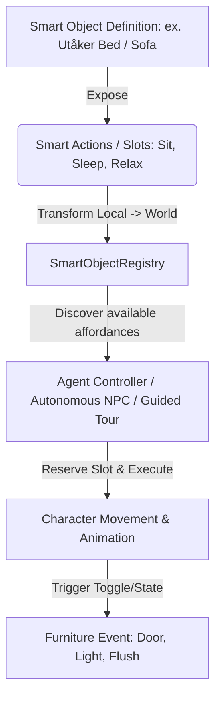

# Plan d'implémentation — Smart Objects (Sims-like)

Ce document présente l'architecture et la stratégie d'implémentation pour introduire les **Smart Objects** dans le projet, passant d'un modèle de coordonnées de zones mondes statiques et rigides à un système d'objets intelligents inspiré des Sims.

---

## 🎯 Contexte & Objectifs

Actuellement, le comportement des avatars (visite guidée, PNJ autonomes comme Delphina) repose sur des coordonnées mondes globales prédéfinies dans [`ZoneNodes.ts`](file:///home/dinatih/Projects/room-3d/src/features/scene/ai/ZoneNodes.ts) (ex: `Lit_Ouest`, `Toilette`, `Canape_Est`, etc.).

### Limitations du système actuel :
1. **Couplage fort au repère monde** : Si un meuble est déplacé ou orienté différemment dans [`Placements.tsx`](file:///home/dinatih/Projects/room-3d/src/features/scene/Placements.tsx), les zones IA deviennent fausses et l'agent s'assoit dans le vide ou traverse le meuble.
2. **Pas d'affordances d'objets (Sims)** : Un lit ou un canapé ne "déclare" pas ses slots d'interaction, ses animations compatibles ou ses pré-conditions (ouvrir une porte avant d'entrer).
3. **Multi-places / Slots limités** : Pour un lit ou un canapé à plusieurs places, il faut créer artificiellement `Lit_Ouest_1`, `Lit_Ouest_2`, etc.

### Objectif des Smart Objects :
- **Affordance & Autonomie** : Chaque meuble/objet 3D définit ses capacités d'interaction (*Smart Actions* / *Interaction Slots* : s'asseoir, s'allonger, cuisiner, se laver, allumer...).
- **Repère local / Attachement** : Les points d'approche (`approachPos`), les points d'interaction (`interactionPos`), l'orientation (`rotY`) et les animations associées sont définis relativement à l'objet ou résolus dynamiquement à partir de sa transformation monde.
- **Registre dynamique (SmartObjectRegistry)** : Découverte et réservation des objets disponibles dans la scène (utile pour l'autonomie des PNJ sans collisions de slots).
- **Rétro-compatibilité & Transition fluide** : Les scénarios existants (visite guidée, actions du panneau latéral) continuent de fonctionner en ciblant les Smart Objects au lieu de simples IDs de nœuds bruts.



---

## 🔍 Architecture Technique Proposée

### 1. Modèle de données Smart Objects (`src/features/scene/ai/smartObjects.ts` ou `aiTypes.ts`)

```ts
export type SmartObjectCategory = 
  | 'seating'      // Canapés, chaises, fauteuils
  | 'bed'          // Lits (repos, sommeil)
  | 'hygiene'      // Douche, lavabo, baignoire, WC
  | 'surface'      // Bureaux, plans de travail, tables
  | 'appliance'    // Four ninja, réfrigérateur, congélateur, Linky, Nest Mini
  | 'storage'      // Kallax, placards, armoires
  | 'door'         // Portes simples, coulissantes, baies vitrées
  | 'decor';       // Plantes, miroirs, oiseaux

export interface InteractionSlot {
  slotId: string;             // ex: 'seat_left', 'seat_right', 'lie_head_north'
  name: string;               // Label lisible
  localOffset: [number, number, number]; // Position d'interaction relative à l'objet (ou offset monde)
  localApproachOffset?: [number, number, number]; // Position d'arrivée avant de s'asseoir/interagir
  rotationYOffset: number;    // Orientation relative ou absolue du personnage
  animation: string;          // Chemin vers le clip GLB (anim_sitting_idle, anim_sleeping_idle, etc.)
  duration?: number;          // Durée d'interaction par défaut (s)
  availableAnims?: string[];  // Variantes possibles pour l'aléatoire
  triggerEventKey?: string;   // Event à déclencher (ex: 'wc-flush', 'eastGlassDoor')
  triggerTargetState?: boolean;
}

export interface SmartObjectDef {
  id: string;                 // Identifiant unique de l'instance (ex: 'bed-west', 'toilet', 'sofa-garden')
  name: string;               // Nom affiché (ex: 'Lit Utåker Ouest')
  category: SmartObjectCategory;
  position: [number, number, number]; // Position monde de l'objet
  rotationY?: number;         // Orientation monde de l'objet
  slots: InteractionSlot[];   // Slots d'interaction disponibles
  requiresDoorAccess?: { doorKey: string; approachNode?: string }; // Pré-actions automatiques si nécessaire
}
```

---

## 🛠️ Modifications Proposées

### Component 1: Cœur IA & Définitions Smart Objects (`src/features/scene/ai/`)

#### [NEW] `src/features/scene/ai/smartObjectRegistry.ts`
- Définition du dictionnaire de tous les Smart Objects de l'appartement (Lit Ouest, Lit Est, Canapés Jardin, Douche, Baignoire, WC, Bureau 1, Bureau 2, Cuisine, Kallax, etc.).
- Calcul automatique des positions mondes réelles des slots (`getSlotWorldTransform(objectId, slotId)`).
- Fonctions d'accès :
  - `getSmartObject(id)`
  - `getAllSmartObjects()`
  - `getSmartObjectsByCategory(category)`
  - `getRandomSmartAction(category?)`

#### [MODIFY] `src/features/scene/ai/aiTypes.ts`
- Enrichir `AgentInstruction` pour supporter le ciblage par Smart Object :
  ```ts
  export interface AgentInstruction {
    type: InstructionType;
    smartObjectId?: string;   // ex: 'bed-west'
    slotId?: string;          // ex: 'seat-1' ou auto-choisi
    targetNodeId?: string;    // Fallback pour nodes de couloirs / transitions de portes
    // ...
  }
  ```

#### [MODIFY] `src/features/scene/ai/useAgentController.ts`
- Adapter la résolution des cibles de déplacement et d'interaction :
  - Si `instruction.smartObjectId` est présent, résoudre la position et l'orientation cible depuis le registre des Smart Objects.
  - Gestion fluide des transitions (approche du slot -> positionnement exact -> exécution de l'animation d'affordance).

#### [MODIFY] `src/features/scene/ai/AiZonesHelper.tsx`
- Évoluer l'helper visuel (activable via `aiZones` dans le panneau latéral) pour afficher à la fois les Smart Objects avec leurs slots interactifs (icônes / couleurs par catégorie) et les points de passage/portes.

---

### Component 2: Intégration Scénarios & PNJ (`src/features/scene/SingleCharacter.tsx`)

#### [MODIFY] `src/features/scene/SingleCharacter.tsx`
- Refactoriser `buildAutonomousScenario()` pour sélectionner des Smart Objects disponibles de manière dynamique au lieu de listes d'instructions hardcodées.
- Simplifier `ACTION_GO_TO_TOILET`, `ACTION_SHOWER`, `ACTIONS_BATHTUB`, `ACTIONS_BED_WEST`, etc., en séquences de haut niveau basées sur les Smart Objects.

---

### Component 3: Placements & Synchronisation d'Items (`src/features/scene/Placements.tsx`)

#### [MODIFY] `src/features/scene/Placements.tsx`
- Aligner les `hoverAction` existantes et les `userData` des items sur les identifiants des Smart Objects afin que le clic/hover sur un objet dans la scène 3D puisse directement être relié à ses affordances IA.

---

## 🧪 Plan de Vérification

### 1. Validation Typescript & Build
- Exécuter `npx tsc --noEmit` pour s'assurer d'aucun problème de typage.
- Exécuter `npm run build` pour vérifier la compilation Vite.

### 2. Vérification Visuelle & Comportementale
- Activer l'affichage des helpers IA (`Zones IA / Smart Objects` dans le SidePanel) : vérifier la position des cibles et slots au niveau des meubles (lits, WC, canapés, etc.).
- Tester les actions IA depuis le panneau latéral (Visite guidée, Aller aux toilettes, Travailler Bureau, Se doucher, Dormir sur le lit).
- Vérifier le comportement autonome de Delphina (animations fluides, enchaînement correct sans blocage aux portes).
